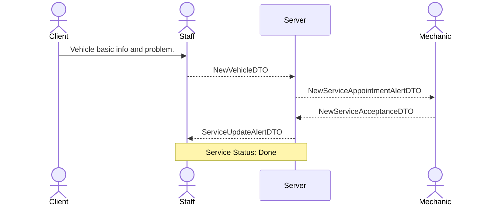

# DTO Planning

This document contains the planning structure for the flow of actions to be implemented in the app.

## New Service - Basic Flow
When a new service arrives and is scheduled for the next free time slot.
> Assumes the mechanic is free, accepts the service, and does not need to wait for parts.

