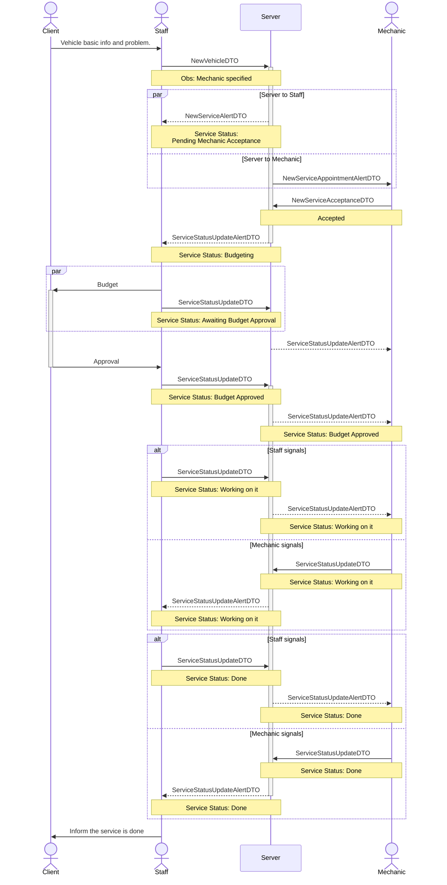
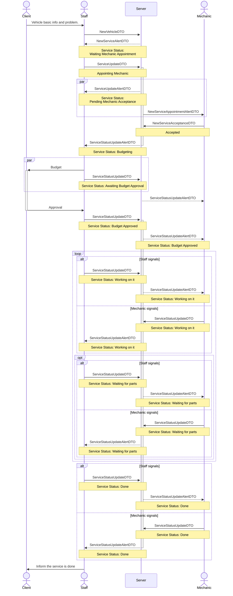
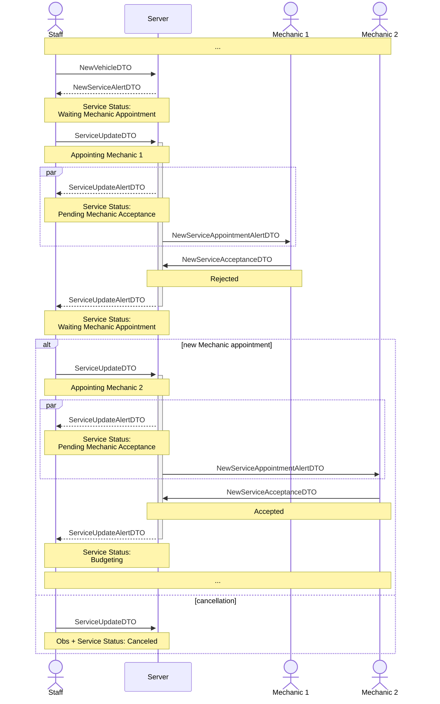
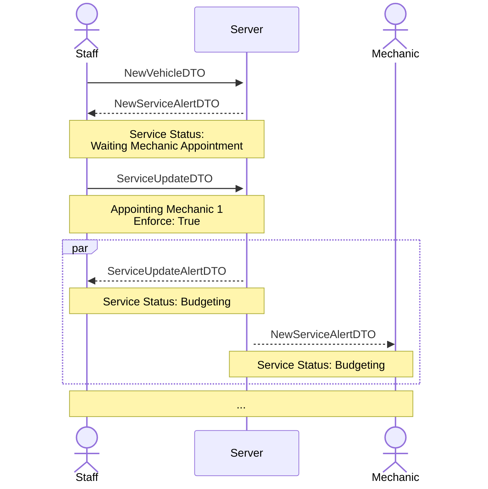
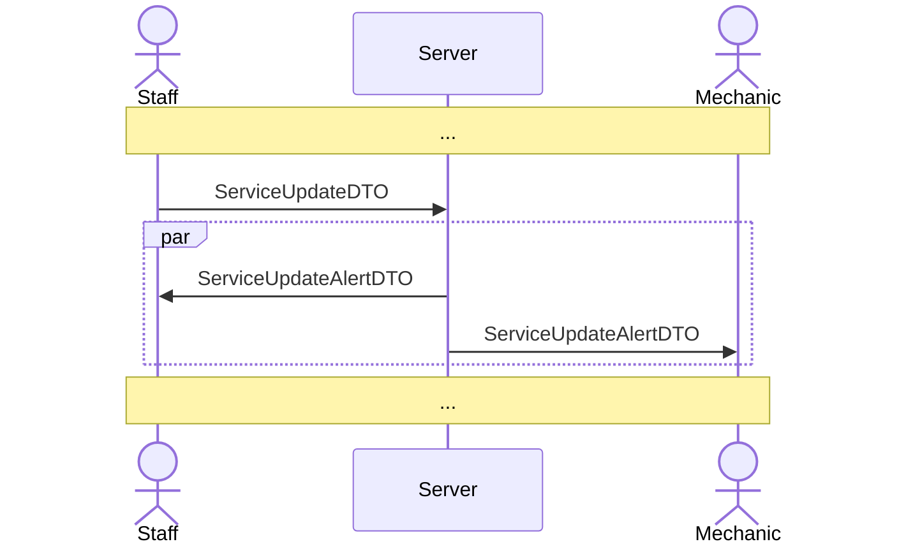
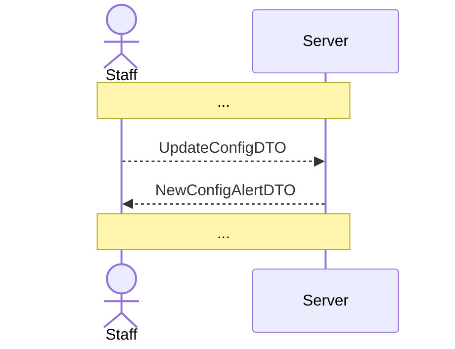

# Flow Planning

This document contains the planning structure for the flow of actions to be implemented in the app.

## Main Flows

### New Service - Basic Flow
When a new service arrives and is scheduled for the next free time slot.
> Assumes the mechanic is free, accepts the service, does not need to wait for parts, and the client approved the budget.

### New Service - Expanded Flow
When a new service arrives and is scheduled for the next free time slot.
> Assumes there is no mechanic free the first moment, when one is appointed he accepts the service, some parts are missing, and the client accepts the budget.

## Other Flows

### Mechanic does not accept a service
When the mechanic does not accept the service, it awaits a new appointment or, rarely, to be canceled.

### Mechanic doesn't have access to the system
When the mechanic doesn't have access to the system, by any reason (e.g. phone battery dies), or by superior orders the staff can enforce appointment of the mechanic, avoding the wait for the service acceptance.
> The system will not ensure the vehicle plate and Km be provided to start a service, to avoid constraints when the Staff is very busy, but the interface must present a visual representation that this information is missing and must be provided.

### Updating service data
When there is a need to update wrong data or add new obs to a existing service.

### Updating app configuration
When the staff change a app setting to fit the system to the new need, e.g. always enforce the mechanic, when they will not use their phone to work.

